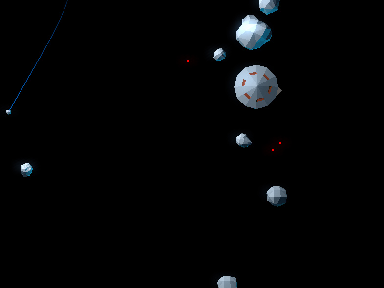
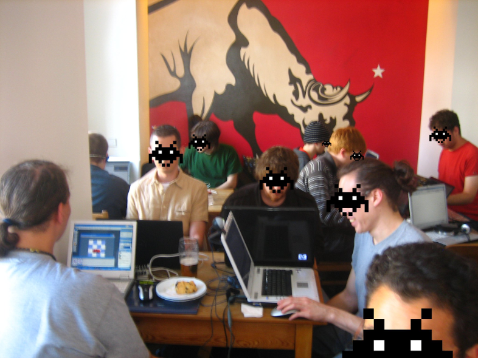
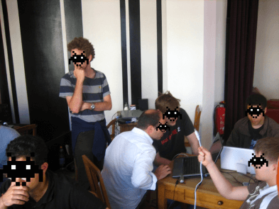
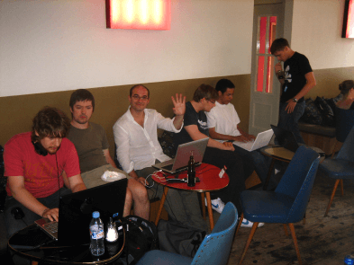

# Transparent Aluminium Starfield

_Transparent Aluminium Starfield_ is an asteroids-like game prototype made for the THE BERLIN INDIE GAME JAM 2009. The roles are switched-over, the player controls all the asteroids instead of controling the starship.

The BIGJam proposed a session of 3 hours coding for each game, on a collective theme. IIRC, the theme was `Transparent Aluminium` or something like that. Sven, Brandon and myself decided about the title of the game then started designing stuff...

The game is implemented in [Squirrel](https://github.com/albertodemichelis/squirrel), based on a custom engine (aka GameStart3D).

## Credits

- Graphics: Ptoing
- Music: BMcC
- Code: Astrofra

## About BIGJam (Berlin Indie Game Jam) 

BIGJam was a gathering for indie game developers held in Berlin from July 31 to August 3, 2009, where artists, musicians, and programmers collaborated on creative projects in a café setting ([ST OBERHOLZ, BERLIN](https://sanktoberholz.coffee/)). Participants could engage in loosely themed 3-hour game competitions and work on their own ideas, while networking with like-minded, talented individuals.

 

 
_Photos by [qubodup](https://github.com/qubodup)_
